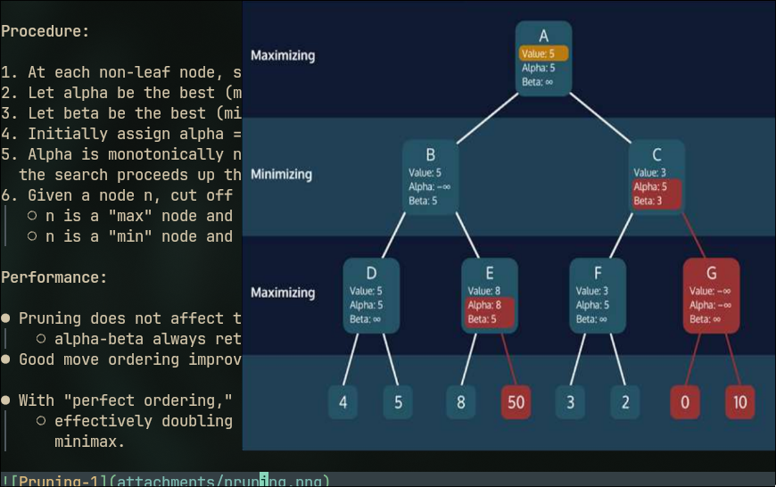
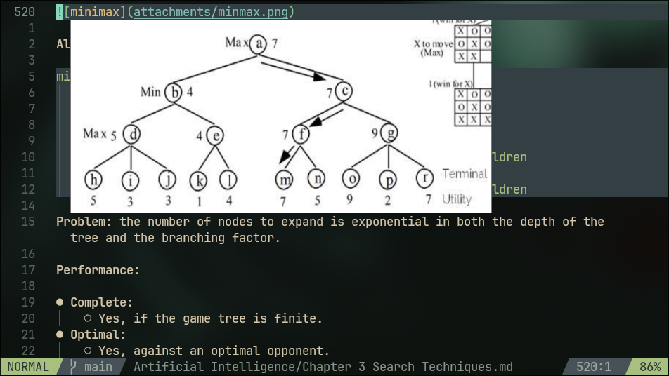
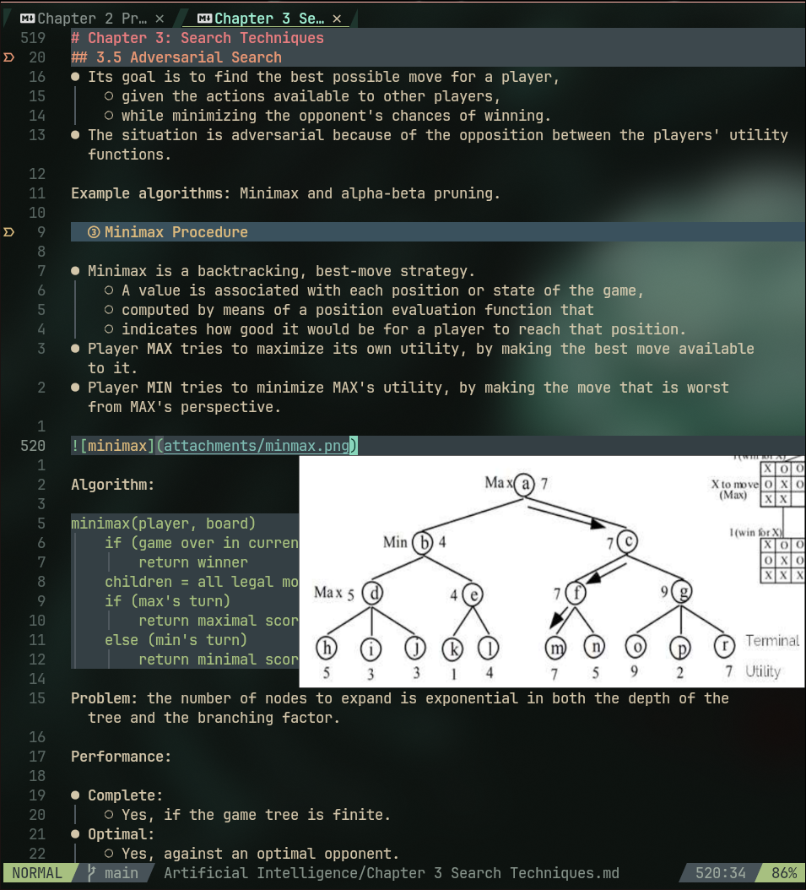

# Image-Cursor.nvim Plugin

Plugin to view images for markdown, right in your terminal, following the cursor (currently tested on kitty 0.48.2)

The basic idea is to fetch the line of the cursor in the visible window, using Neovim 0.13's built-in `vim.ui.img` (with Kitty graphics protocol). If an image is on the cursor, it is displayed, if we move off the line, it disappears.

# Requirements

- Noevim 0.13+ (I built it straight from source, as the currently latest version available is only 0.12.5)
    - To build from source, either follow the [Nvim development (prerelease) build guide](https://github.com/neovim/neovim/releases)
    - Or simply: clone the repo: `git clone https://github.com/neovim/neovim`
    - then, (for Linux) hit 2 commands inside the repo directory:
        - `make CMAKE_BUILD_TYPE=RelWithDebInfo`
        - `sudo make install`
    - and viola, nvim 0.13 is installed.
- A terminal that supports Kitty graphics protocol (Kitty, WezTerm, Ghostty, and similar)
- Currently, PNG is the only one supported.
    - JPG, WEBP and GIF are primary target for next version of the plugin.
    - See below for why

# Installation

With [lazy.nvim](https://github.com/folke/lazy.nvim):

```lua
{
  "causality-enjoyer/image-cursor.nvim",
  ft = { "markdown" },
  opts = {},
}
```

`opts = {}` is enough to get default behavior. See [Configuration](#configuration) for what's available.

With other plugin managers, install repo as normal, and call the setup as:

```lua
require("image-cursor").setup({})
```

# Configuration

```lua
require("image-cursor").setup({
    -- which filetypes to watch for image links in
    filetypes = { "markdown" },
    -- max preview size, unit: terminal cells
    max_width_cells = 40,
    max_height_cells = 20,
    -- min usable cell height
    min_height_cells = 6,
    -- ratio for cell width/height for your terminal, defaults to 0.5
    cell_aspect = nil,

    -- keymap to mannually toggle the preview for current line
    -- Set to false to disable
    keys = {
        toggle = "<leader>ii",
    }
})
```

## How it decides where to draw the image

- **Vertically**:
    - Draw *below* the cursor's line, with a gap so the cursor's own line stays readable.
    - If there isn't enough room below (e.g. your cursor is near the bottom of the window), it flips to drawing *above* instead.
- **Horizontally**:
    - Anchors near the cursor's column, but slides left if that would run the image off the right edge of the window.
- **Size**:
    - Reads the image file's actual pixel dimensions
    - and fits them into the configured max box while preserving aspect ratio

## Supported formats

Currently, I've written for PNG only, as its the easiest to thaw out the image's pixels info, straight by reading it from the png file.
Will need to look up JPGs, and GIFs and add them later on.
Also, I need to further explore what `vim.ui.img` supports.
I'm in the middle of my exam, making notes, thats why I hurriedly developed this, as soon as they are over, will be developing further.

If you can add a format:
1. Create `lua/image-cursor/formats/<name>.lua` with a `dimensions(path)`
   function returning `width, height` (in pixels) or `nil`.
2. Register the extension in `lua/image-cursor/formats/init.lua`'s
   `READERS` table.

Contributions for other filetypes are welcome. Just check `formats/png.lua` for the pattern to follow.

# Directory Structure

```
lua/image-cursor/
├── init.lua        -- public entrypoint, autocmds, ties modules together
├── config.lua      -- default options + merging
├── parser.lua      -- markdown image-link syntax, path resolution
├── placement.lua   -- pure geometry: where/how big (no vim.* calls)
├── state.lua       -- tracks the one currently-shown image
└── formats/
    ├── init.lua    -- dispatches to a reader by file extension
    └── png.lua     -- PNG IHDR dimension reader
```

## Note on functions:

1. `placement.lua`
    - it has no dependency on vim global, its just functions and plain numbers.
2. Neovim embeds with LuaJit, as I did find `string.pack`/`string.unpack` functions to read binary, but couldn't make them work with LuaJit.
3. This is my first time building anything with `Lua`, so its bodged project, not a fully realized one yet. I'm more used to `C`.

# Screenshots

1. When the cursor is too low on the window
    - 
2. Normal condition, when the cursor is at the middle
    - 
3. When the cursor is at far-right, the image is still within bounds, by shifting the image behind the cursor's position
    - 

# License


 
# References

1. Original inspiration from this youtube video, I believe he posts in neovim's reddit as well
    - [Neovim 0.13 has a new API for images](https://youtu.be/UHA1gTZYXyU?si=m2OkHkmAZ8Uwo05_)
2. PNG file format
    - [From libpng](https://www.libpng.org/pub/png/spec/1.2/PNG-Structure.html)
    - [This helpful article](https://medium.com/@0xwan/png-structure-for-beginner-8363ce2a9f73)

